# Semantics-Guided-Generative-Image-Compression

## Samples
Reconstruction of images from CLIC2020 Dataset at bitrate ≈ 0.023 BPP
| Ground Truth           |  VVC |  MISC | Ours |
:-------------------------:|:-------------------------:|:-------------------------:|:-------------------------:|
|  |  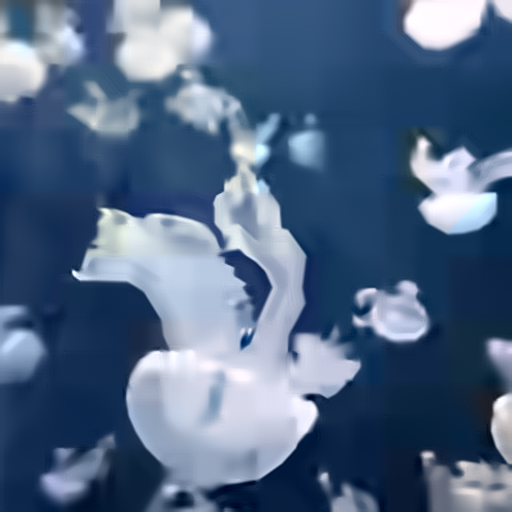 |     |  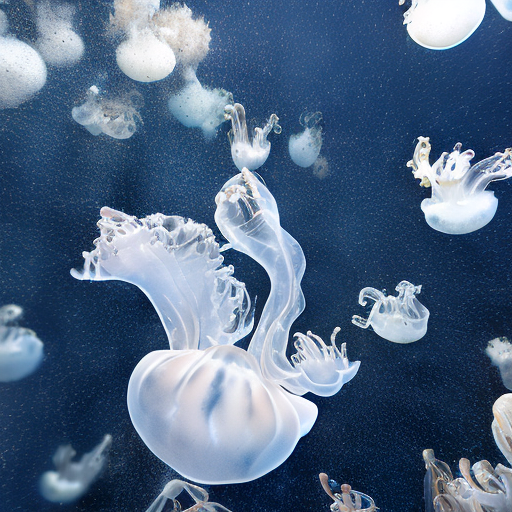  |
|  |  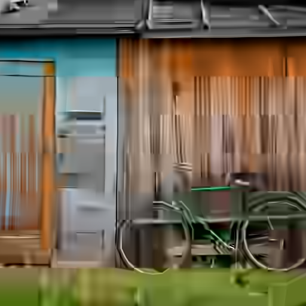 |  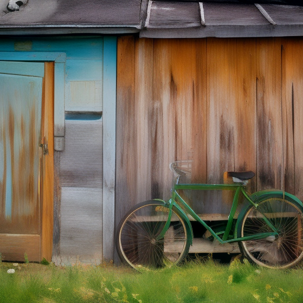   |    |
| 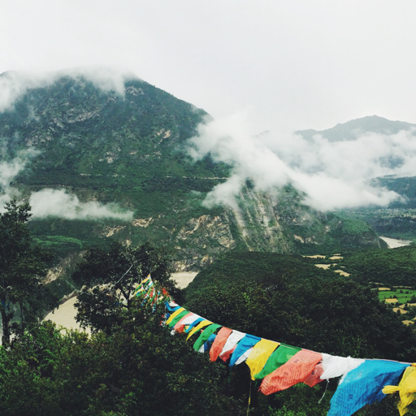 |  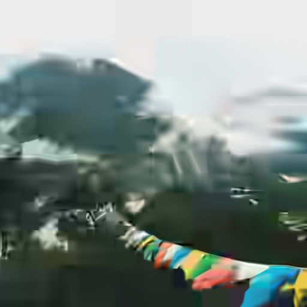 |     |  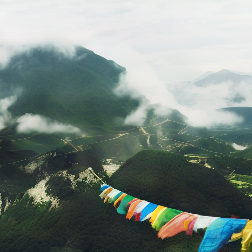  |
| 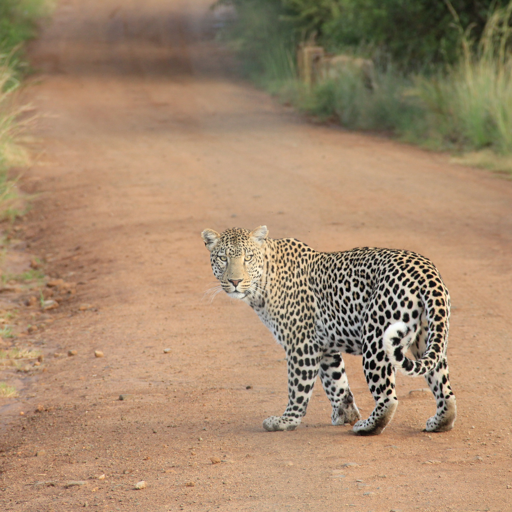 |  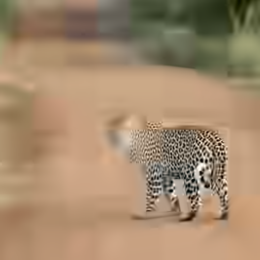 |  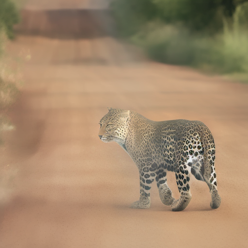   |    |
| 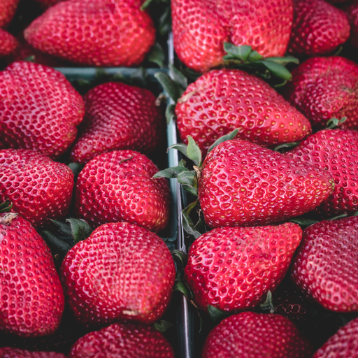 |  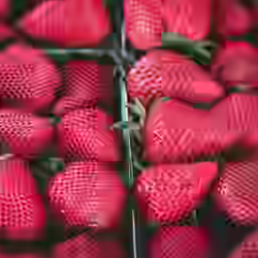 |  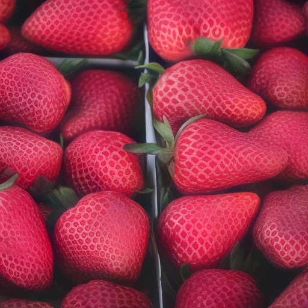   |    |
