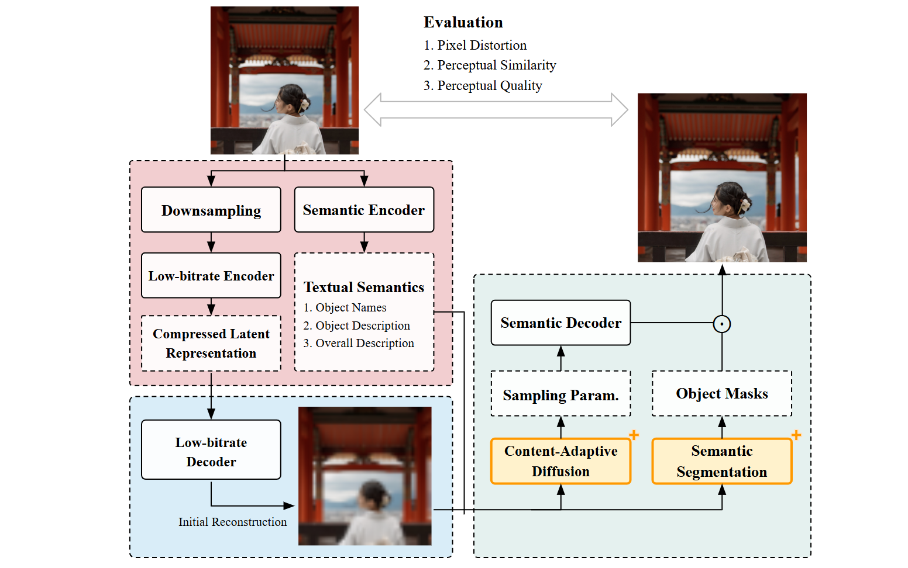

# Semantics-Guided-Generative-Image-Compression
Advancements in generative models and text-to-image capabilities have enabled them to serve as backbones for image compression, reducing the need for detailed latents and allowing higher compression ratios. By storing structural semantics as latents, flexible image editing and manipulation is also possible. This study introduces a semantic-guided image compression framework built upon a diffusion-based generative codec called MISC, enhancing reconstruction quality at both the pixel and perceptual levels while reducing diffusion sampling costs. Key components include a semantics encoder for structured guidance, a dynamic diffusion (DynDiff) module for adaptive sampling, and a semantics segmentation module for accurate reconstruction. On the CLIC2020 dataset, the proposed method surpasses mainstream codecs (e.g., Cheng2020, HiFiC, VVC, BPG) in perceptual similarity and image quality. It also improves upon MISC while reducing sampling iterations by 40%, significantly decreasing decoding time and making the framework more practical.

## Framework Architecture

## Samples
Reconstruction of images from CLIC2020 Dataset at bitrate ≈ 0.023 BPP
| Ground Truth           |  VVC |  MISC | Ours |
:-------------------------:|:-------------------------:|:-------------------------:|:-------------------------:|
|  |   |     |    |
|  |   |     |    |
|  |   |     |    |
|  |   |     |    |
|  |   |     |    |
